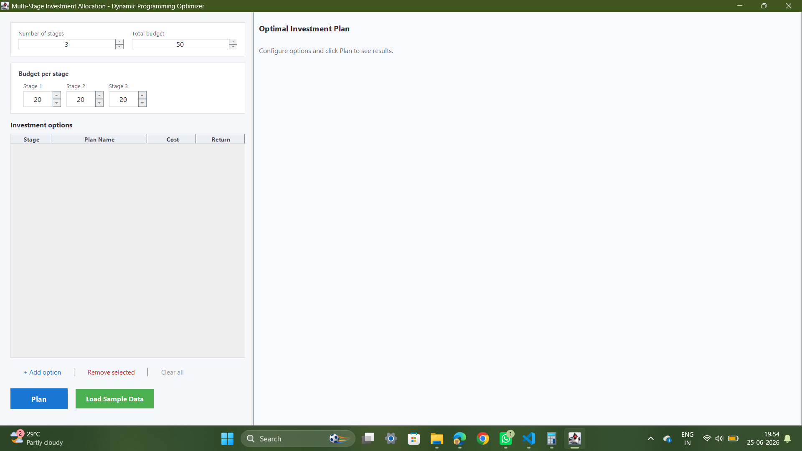
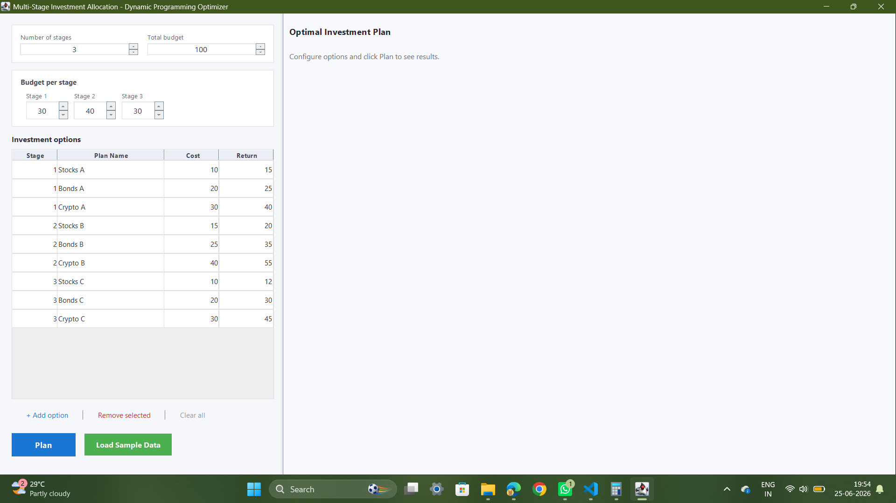
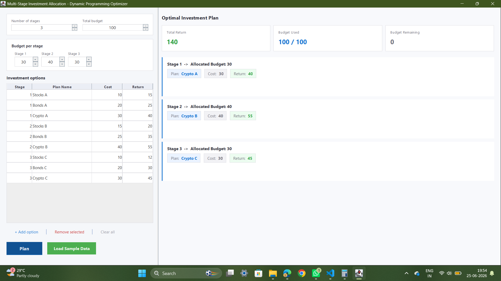

# Multi-Stage Investment Allocation Optimizer

A Java Swing desktop application that determines the optimal investment strategy across multiple stages using **Dynamic Programming**. The application maximizes total return while respecting budget constraints for each investment stage.

---

## Features

- Dynamic Programming based optimization
- Multi-stage investment planning
- Interactive Java Swing GUI
- Budget allocation per stage
- Investment cost and return comparison
- Automatic optimal investment selection
- Sample dataset loader
- Budget utilization summary
- Stage-wise investment recommendations

---

## Technologies Used

- Java
- Java Swing
- Dynamic Programming
- Object-Oriented Programming (OOP)

---

## Project Structure

```
investment-optimizer/
│
├── src/
│   └── InvestmentOptimizer.java
│
├── screenshots/
│   ├── home.png
│   ├── sample-data.png
│   └── result.png
│
├── README.md
└── .gitignore
```

---

## Screenshots

### Home Screen



---

### Sample Investment Data



---

### Optimal Investment Plan



---

## How It Works

1. Specify the number of investment stages.
2. Enter the total available budget.
3. Allocate budgets for each stage.
4. Add investment options including:
   - Stage
   - Investment Name
   - Cost
   - Expected Return
5. Click **Plan**.
6. The application uses Dynamic Programming to compute the optimal investment allocation.

---

## Sample Dataset

The application includes a built-in sample dataset containing investment options across multiple stages. Clicking **Load Sample Data** automatically populates the investment table for demonstration purposes.

---

## Dynamic Programming Approach

The optimization problem is solved using Dynamic Programming by evaluating investment decisions at every stage while satisfying budget constraints.

The algorithm:

- Maximizes total return
- Preserves stage-wise budget limits
- Selects the optimal investment for each stage
- Produces the highest achievable cumulative return

---

## Learning Outcomes

This project demonstrates:

- Dynamic Programming
- Optimization Algorithms
- Java Swing GUI Development
- Object-Oriented Design
- Event-Driven Programming
- Desktop Application Development

---

## Author

**Riya Dodiya**

B.Tech – Artificial Intelligence & Machine Learning
